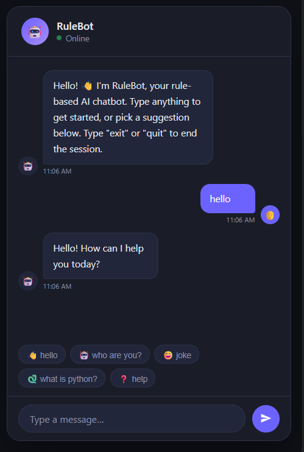
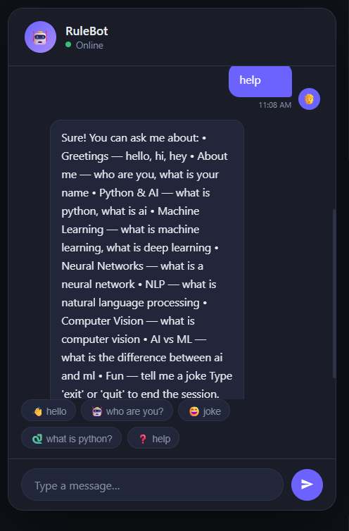
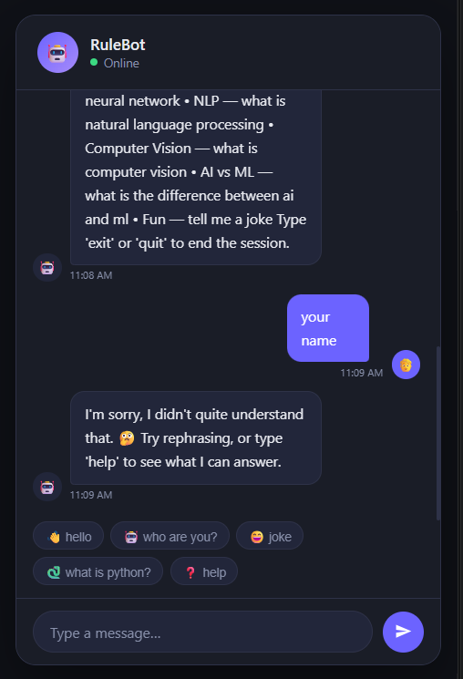
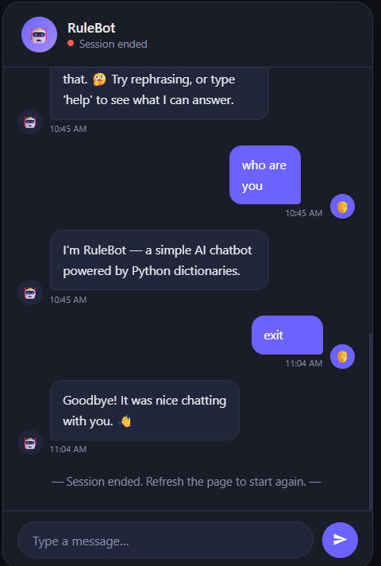

# RuleBot-Web-Chatbot-project-1
# RuleBot - AI Chatbot 🤖

RuleBot is a rule-based AI chatbot developed using Python, HTML, CSS, and JavaScript as part of the Decode Labs Artificial Intelligence Internship - Project 1.

## 📌 Project Overview

This chatbot uses predefined rules and dictionary-based responses to answer user queries. It can handle greetings, AI-related questions, Python concepts, machine learning topics, jokes, help commands, and more.

The chatbot runs through a web-based interface and provides an interactive conversational experience.

## 🚀 Features

- Rule-based chatbot system
- Continuous user interaction
- Predefined intent-based responses
- Help menu with supported commands
- AI and Machine Learning knowledge responses
- Fallback response for unknown inputs
- Exit and session termination support
- Interactive web interface
- Python backend integration

## 🛠️ Technologies Used

- Python
- STEPS SCREENSHOTS :
- ## 📸 Screenshots

### Welcome & Greeting

### Help Command

### Unknown Input Handling

### Exit Command

